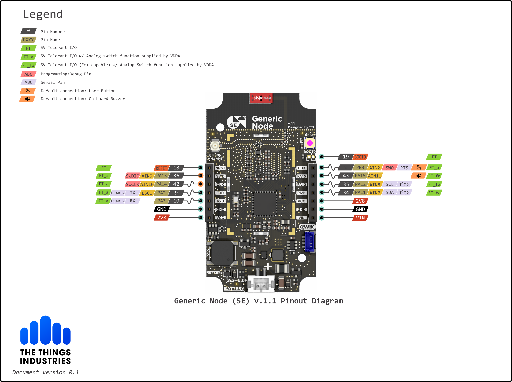
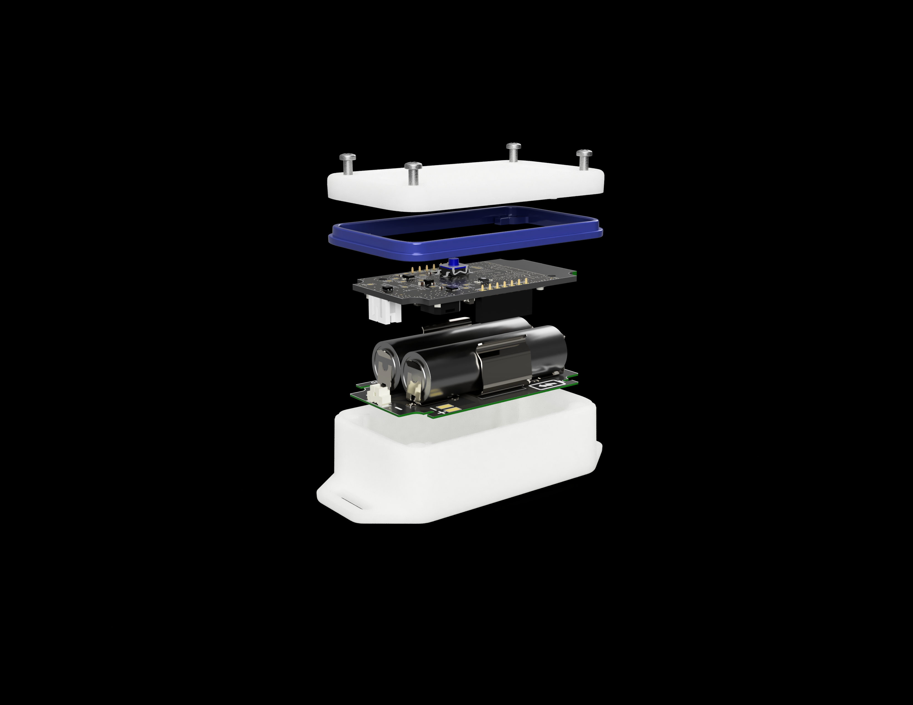

# Generic Node Sensor Edition (GNSE)

## About

LoRaWAN promised you roaming, secure and low-cost sensors that last on a battery for years. _Generic Node_ platform delivers this promise with additional strong end to end encryption and firmware over the air update in a device with multiple sensors that can be configured and programmed to support many use cases.

This repository contains all the necessary hardware and software files for the GNSE LoRaWAN node. The core of the system is based off the STM32WL55xx dual-core LoRaWAN SOC.

## Specification
- [STM32WL55CCU6](https://www.st.com/en/microcontrollers-microprocessors/stm32wl-series.html) dual-core Arm Cortex®-M4/M0+ @48 MHz
- 256 Kbytes of Flash & 64 Kbytes of SRAM
- SX126x sub-GHz radio
- Power output up to +22.00 dBm
- LoRa, (G)FSK, (G)MSK, BPSK modulations
- 868 MHz & 915 MHz dual-band operation
- 2xAA battery powered node with wide input voltage range: 2.2V - 5.5V
- [ATECC608A-TNGLORA](https://www.microchip.com/wwwproducts/en/ATECC608A-TNGLORA) pre-provisioned LoRaWAN secure element
- [LIS2DH12](https://www.st.com/en/mems-and-sensors/lis2dh12.html) - ULP 3-axis accelerometer
- [SHTC3](https://www.sensirion.com/en/environmental-sensors/humidity-sensors/digital-humidity-sensor-shtc3-our-new-standard-for-consumer-electronics/) humidity and temperature sensor
- [MX25R1635](https://www.macronix.com/en-us/products/NOR-Flash/Serial-NOR-Flash/Pages/default.aspx) 16Mb SPI NOR Flash for FUOTA and data-logging
- A user button, an RGB LED, a buzzer and a user-friendly expansion and programming options.

## Development

The necessary schematics and the PCB files can be found in [Hardware](./Hardware).

Software libraries and sample applications can be found in [Software](./Software).

## Documentation

The [Generic Node documentation website](https://www.genericnode.com/docs/) provides information about the node hardware and software features.

## Contribution

Our [contribution guideline](./CONTRIBUTING.md) provides more information on how to assist us with the development of GNSE.

## Legal

Copyright © 2021 The Things Industries B.V.

[Contact The Things Industries](https://thethingsindustries.com/contact/) for licensing.
