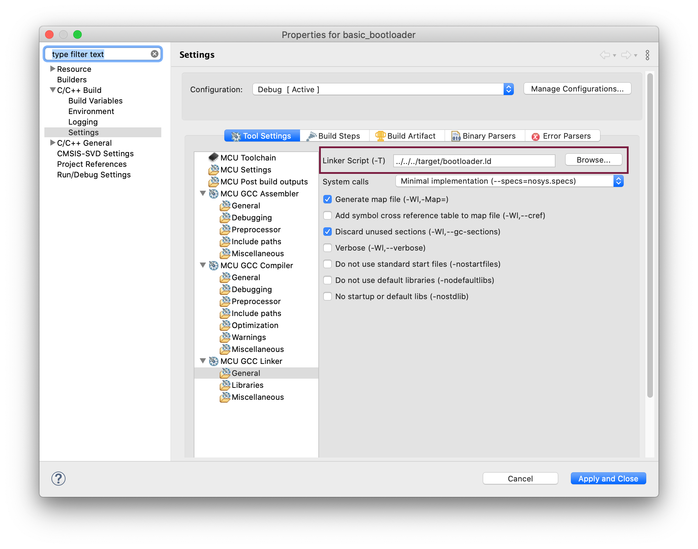
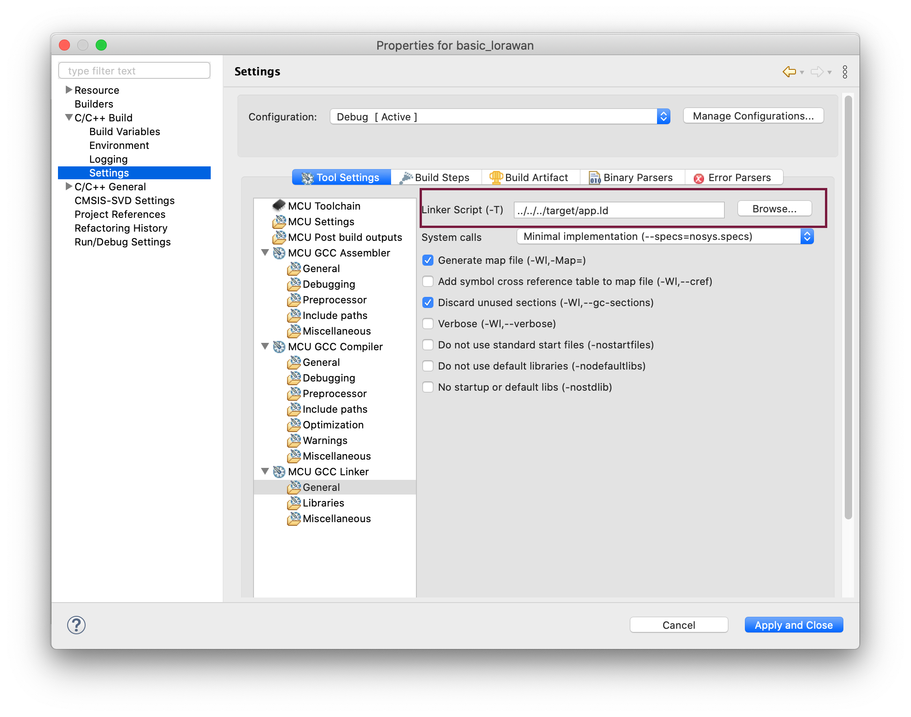

# basic_bootloader

## Description

The application provides a basic bootloader that can be combined with other applications to perform a specific functionality at boot time.

> If you want to learn more about the purpose of a bootloader, we recommend reading this great [blog post](https://interrupt.memfault.com/blog/how-to-write-a-bootloader-from-scratch).

`basic_bootloader` performs one of two functionalities based on the GNSE button:

1. If the button is not pressed -> boots the user flashed application
2. If the button is pressed long enough -> boots the ST internal bootloader

## Configuration

`basic_bootloader` key configurations:

### Memory Map

The internal flash (ROM) memory map can be configured to accommodate a bootloader and an application by adjusting the parameters defined in [`memory_map.ld`](./../../target/memory_map.ld).

```
BOOTROM  (rx)  : ORIGIN = 0x08000000, LENGTH = 0x00000B000   /* Flash memory dedicated to bootloader */
APPROM   (rx)  : ORIGIN = 0x0800B000, LENGTH = 0x000035000   /* Flash memory dedicated to application */
```

### App activity

The application behavior can be adjusted by modifying [`conf/app_conf.h`](./conf/app_conf.h).

- `GNSE_TINY_TRACER_ENABLE` enables UART (115200/8-N-1) logging of application activity

```c
#define GNSE_TINY_TRACER_ENABLE 1
```

> Please note that it is considered as a best practice to disable logging when building bootloaders to reduce the binary size.

## Setup

To build a `basic_bootloader` that can be combined with another application in the same memory, you need to use a linker script that supports the new memory map.

### Building with CMake

If you are building using CMake, then update [`CMakeLists.txt`](./../../CMakeLists.txt) `LINKER_SCRIPT` flag to `bootloader.ld` when compiling a `basic_bootloader` binary.

```
set(LINKER_SCRIPT ${MCU_DIR}/bootloader.ld)
```

Also, make sure to update `LINKER_SCRIPT` flag to `app.ld` when compiling an application binary that will be combined with the bootloader binary.

```
set(LINKER_SCRIPT ${MCU_DIR}/app.ld)
```

### Building with STM32CubeIDE

If you are building using STM32CubeIDE, then there is no need to change the linker script when building a `basic_bootloader` binary as can be seen below.



But, make sure to change the application linker script from `../../../target/stm32wl55xx_flash.ld` to `../../../target/app.ld`.



### Combining applications

You can combine two binaries such as the `basic_bootloader` and `basic_lorawan` by using the [`bootloader_app_merge` python script](./../../bootloader_app_merge.py).

For example:

```sh
python bootloader_app_merge.py \
-b ./build/debug/app/basic_bootloader/main.bin \
-a ./build/debug/app/basic_lorawan/main.bin \
-s 1 \
-d 0xB000 \
-c 0xB008 \
-o ./build/debug/app/basic_lorawan/boot_basic_lorawan.bin
```

## Observation

The device boots and turns on the red LED.

If the button is not pressed, the red LED will stay on for a small period and the device will boot the user-flashed application.

If the button is pressed for long enough, it will turn on the blue LED and turn off the red LED, indicating a successful input and it will continue to boot the ST internal bootloader.
